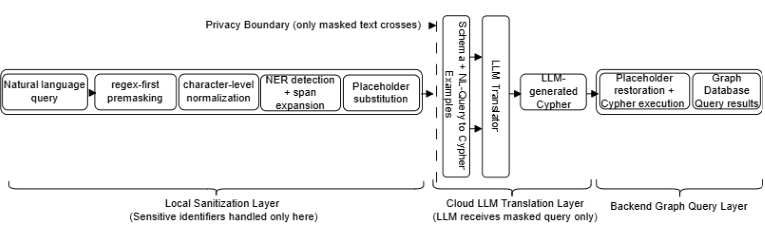

# Privacy-Preserving NL2Cypher Pipeline

A lightweight implementation of a **privacy-preserving natural language to graph query (NL→Cypher) pipeline**, designed for querying sensitive data while preventing leakage of personally identifiable information (PII).

This project demonstrates the **sanitization (masking) layer** of a larger system that enables safe interaction with graph databases using natural language.

## System Overview



Modern applications increasingly rely on natural language interfaces powered by LLMs. However, in sensitive domains (e.g., law enforcement, healthcare), user queries may contain **personally identifiable information (PII)** that must not be exposed to external systems.

This project enforces a **strict privacy boundary**:

- Sensitive entities are detected and masked **locally**
- Only sanitized queries are sent to downstream systems (e.g., LLMs)
- Original values are restored **after query generation**

---

## System Architecture

User Query (Natural Language) -> [Sanitization Layer (This Repo)] -> Masked Query -> [Translation Layer (LLM->Cypher)] -> Cypher Query (with placeholders) -> [De-masking Layer] -> Executable Cypher Query -> Graph Database

## What This Repository Implements

This repository focuses on the **Sanitization Layer**, which:

- Detects sensitive entities (names, ages, locations)
- Normalizes adversarial or irregular inputs
- Replaces entities with structured placeholders
- Maintains mappings for safe reinsertion
       
---

## Key Features

- **Regex-first masking for sensitive attributes**
  - Handles cue-less numeric ages (e.g., `36 → [AGE_1]`)

- **Named Entity Recognition (SpaCy) with span expansion**
  - Improved handling of multi-token names (e.g., `Miss Amanda-Lynn Smith`)

- **Adversarial robustness**
  - Character-level normalization (e.g., `W@ng → Wang`)

- **Placeholder-based masking**
  - Replaces entities with structured placeholders (e.g., `[PERSON_1]`)

- **Reinsertion support**
  - Restores original values after downstream processing

## End-to-End Example

### Input (User Query)

```text
What are the offenses committed by M. Lopez, 36, in Phoenix?
```

**Sanitization Layer Output (Implemented Here)**

```text
What are the offenses committed by [PERSON_1], [AGE_1], in [CITY_1]?
```

**Translation Layer Output (LLM → Cypher, Conceptual)**

```text
MATCH (p:Person)-[r:COMMITTED]->(c:CRIME)
WHERE p.name = PERSON_1 AND p.age = AGE_1 AND r.city = CITY_1
```

**De-masking Query (Executed in Database):**

```text
MATCH (p:Person)-[r:COMMITTED]->(c:CRIME)
WHERE p.name = "M. Lopez" AND p.age = 36 AND r.city = "Phoenix"
RETURN c
```

## Translation Layer (Conceptual / External)

The translation from masked natural language queries to Cypher is performed using a large language model (LLM).

This repository focuses on the privacy-preserving preprocessing step. The translation layer is not included in this implementation, but is part of the full system described in the associated research work.


## Project Structure

```text
privacy-preserving-nl2cypher/
├── README.md
├── requirements.txt
├── src/
│   ├── masking.py
│   ├── normalization.py
│   ├── entity_utils.py
│   └── demo.py
├── examples/
│   ├── sample_queries.txt
│   └── sample_outputs.md
```

## Installation

1.  Clone the repository:

    ```bash

    git clone https://github.com/suliadeniye/privacy-preserving-nl2cypher.git

    cd privacy-preserving-nl2cypher
    ```

2. Install Dependencies

    ```bash

    pip install -r requirements.txt
    ```

3.  Download SpaCy language model:

    ```bash

    python -m spacy download en_core_web_sm
    ```

4. Running the Demo

    Navigate to the src directory and run:

    ```bash

    cd src

    python demo.py
    ```

### This will execute a small set of example queries and display:

- Original query
- Normalized query
- Masked query
- Entity mappings
- Restored query

## Notes

- No real or sensitive datasets are included
- Example queries are synthetic
- This is a lightweight demonstration of the full pipeline

## Related Work

This project is part of a broader system for secure natural language interfaces to graph databases, developed during my PhD research and accepted at:
- IEEE ICAD 2025
- IEEE ICAD 2026