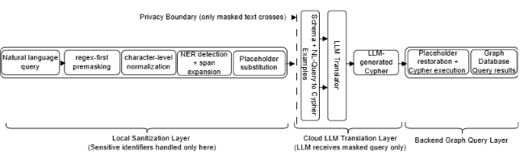

> Privacy-preserving NLP pipeline for masking sensitive entities in real-world query systems (IEEE ICAD 2026)


# Privacy-Preserving NL2Cypher: Masking Pipeline

## System Overview



This repository contains a lightweight implementation of a **privacy-preserving preprocessing pipeline** for natural language queries in sensitive domains. The diagram illustrates the **privacy-preserving masking layer** (left side of the diagram), which ensures that only sanitized queries are passed to downstream LLM and database systems.

The system is designed to **detect, normalize, and mask sensitive entities** (e.g., names, ages, locations) before queries are passed to downstream systems such as large language models (LLMs) or database query engines.

This work is motivated by real-world applications where user queries may contain personally identifiable information (PII), and safe handling is required before external processing.


### Key Idea

The system enforces a **strict privacy boundary**:

- All sensitive entity detection and masking occurs locally
- Only masked (sanitized) queries are sent to the LLM
- Original values are restored only after query generation

This design prevents leakage of sensitive information while still enabling natural language interaction with structured data systems.


## Key Features

- **Regex-first masking for sensitive attributes**
  - Handles cue-less numeric ages (e.g., `36 → [AGE_1]`)

- **Named Entity Recognition (SpaCy) with span expansion**
  - Improved handling of multi-token names (e.g., `Amanda-Lynn Smith`)

- **Adversarial robustness**
  - Character-level normalization (e.g., `W@ng → Wang`)

- **Placeholder-based masking**
  - Replaces entities with structured placeholders (e.g., `[PERSON_1]`)

- **Reinsertion support**
  - Restores original values after downstream processing

## Example

**Input:**
```text
What are the offenses committed by M. Lopez, 36, offenses in Phoenix?
```


**Output:**
```text
    What are the offenses committed by [PERSON_1], [AGE_1], offenses in [CITY_1]?
```


## Project Structure

privacy-preserving-nl2cypher/
├── README.md
├── requirements.txt
├── src/
│   ├── masking.py
│   ├── normalization.py
│   ├── entity_utils.py
│   └── demo.py
├── examples/
│   ├── sample_queries.txt
│   └── sample_outputs.md

## Installation

1.  Clone the repository:

    ```bash

    git clone https://github.com/suliadeniye/privacy-preserving-nl2cypher.git

    cd privacy-preserving-nl2cypher
    ```

2. Install Dependencies

    ```bash

    pip install -r requirements.txt
    ```

3.  Download SpaCy language model:

    ```bash

    python -m spacy download en_core_web_sm
    ```

4. Running the Demo

    Navigate to the src directory and run:

    ```bash

    cd src

    python demo.py
    ```


This will execute a small set of example queries and display:

- Original query
- Normalized query
- Masked query
- Entity mappings
- Restored query


## Notes

- No real or sensitive datasets are included in this repository
- Example queries are synthetic and for demonstration purposes only
- This repository focuses on the privacy-preserving masking layer of a larger system

## Related Work

This repository is part of a broader system for natural language to graph query translation (NL2Cypher), developed during my PhD and accepted at IEEE ICAD 2026.